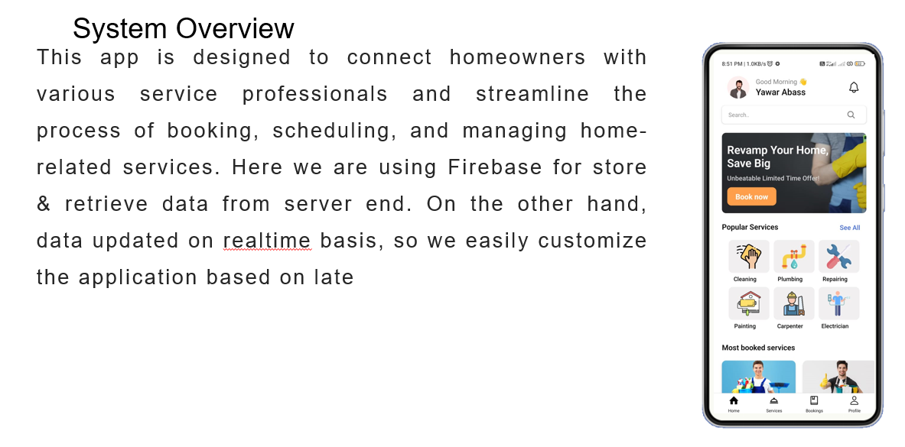

## HOMEHELPIFY : Home services at your fingertips

### Create a .env file in the root directory and add the following variables

```bash
FIREBASE_API_KEY=YOUR_FIREBASE_API_KEY
FIREBASE_DATABASE_URL=YOUR_FIREBASE_DATABASE_URL
```

## Built in React Native and Firebase.

## Features

- User Authentication
- User Profile
- Services List
- Service Details
- Service Booking
- Service History
- Beatufiul UI

## Screenshots




